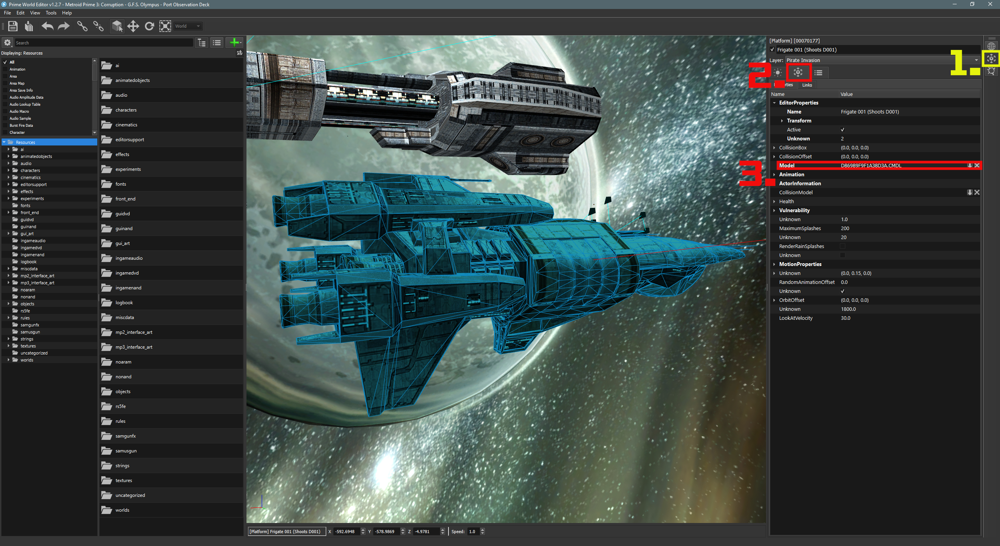

# Metroid Prime Model Extraction

## Preamble
This guide will explain in detail how to extract models from Metroid Prime titles for use in Blender. Be advised that some software cited is either work-in-progress or discontinued, some features are incomplete or have known issues.

## Getting Started
### Basics
- Ample available storage
- A copy of _Metroid Prime_, _Metroid Prime 2: Echoes_, _Metroid Prime 3: Corruption_, or _Metroid Prime: Trilogy_\*

\*_(Not all compressed dump formats are supported.)_

### Software
- [Blender](https://www.blender.org/)
- [hecl](https://mega.nz/file/gl91nDBT#zPi8rX7jBgllvBrULBdVI2dF3O_3ri0a8Zx9tO4TGJ8).\*
- [Prime World Editor](https://github.com/AxioDL/PrimeWorldEditor)
- [Metaforce](https://mega.nz/file/ckMjRART#Sl-0xmP0PiOrZkYnlEjrMwz2gpCd2_fK4nDIVMPOkYg)\*

\*_(hecl and Metaforce are no longer maintained, the marked links are unaffiliated with AxioDL.)_

## Setup
### HECL Blender Add-On
1. Add the Blender system environment variable:
	1a. `Settings` > `System` > `About` > `Advanced system settings`.
	1b. `System Properties` > `Advanced` > `Environment Variables.`
2. Click `New...` under `System Variables` and add a system environment variable with the `Variable name:` `BLENDER_BIN` and a `Variable value:` of Blender's executable path.\* \*\*

3. Run hecl from the terminal and execute the following command: `hecl installaddon`.

\*_(The hecl add-on only supports Blender up to [v2.83](https://www.blender.org/download/releases/2-83/).)_

\*\*_(When adding the environment variable, click `OK` on both `System Properties` dialogs or changes will not be saved.)_

### Prime World Editor
### Extraction
- Run PWE and select `File` > `Create Project`, then choose a location for the extracted contents.\*

\*_(Note that the `*.prj` file is what PWE uses to load a project and is required.)_
### Controls
- `WASD` _(move)_
- `MWheel Click` _(pan)_
- `RMB` _(rotate camera)_
- `LMB` _(select)_
- `Ctrl` _(select multiple)_
- `G` _(game mode)_
- `1` _(toggle world geometry visibility)_
- `2` _(toggle objects visibility)_
- `3` _(toggle world collision visibility)_
- `4` _(toggle object collision visibility)_
- `5` _(toggle lights visibility)_
- `6` _(toggle skybox visibility)_

_(\*Game mode disables GUI elements and renders a scene as it appears in-game.)_

### Metaforce
1. Set the `Extract Directory:` and `Blender Override Path:` values.\*
2. Click `Extract` and choose a path for the extracted contents.

\*_(`Blender Override Path:` is optional if Blender is properly installed and only for using specific versions.)_

## Objects
1. From an open project, navigate game worlds and scenes from the right-hand panel _(1.)_.\*
2. From a world, open a room. _(2.)_.

3. Ensure that at least the `World` and `Object` layers are set to visible under `View`.

4. Select an object  with `LMB`, then click the `Edit Script` tab _(1.)_.\*\*
5. From `Edit Script`, click the `Properties` tab _(2.)_.
6. Copy the model name _(3.)_.

7. Search the Metaforce extraction directory for the associated `*.blend` file.

\*_(Note that rooms prefixed with`!` are usually not used for locating models and are usually used for globally accessed resources.)_

\*\*_(World geometry cannot be selected in PWE, some objects are part of world geometry..)_

## World Geometry
1. For objects that are part of world geometry, navigate to the room sub-directory of a world directory in the Metaforce extraction directory.
2. Some `*.blend` file names do not contain obvious indicators of which world chunk they are for, the best I can advise is opening them until you find the right one.\*

\*_(Some rooms will contain either multiple `*.blend` files or even multiple sub-directories containing world geometry.)

## Extra
- Both PWE and Metaforce extraction steps are both CPU intensive and will take some time to process. Some games may throw errors due to limited support.
- To easier manage or share models, open a `*.bleend` file, then select `File` > `External Data` > `Pack Resources` to bundle textures and materials within the `*.blend` file.
